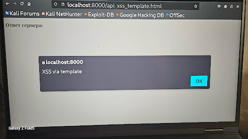
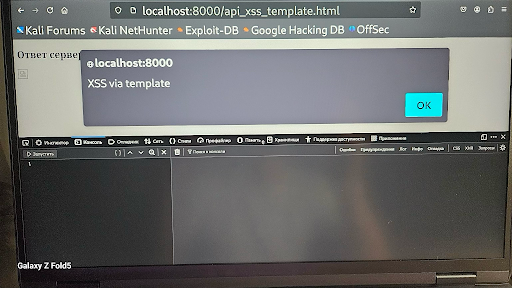

# 🛡️ Vulnerability Report: API XSS via `template` and `innerHTML`

---

### 🔬 Test Context

- **Target:** Custom Localhost API — DOM Injection
- **Vector:** `innerHTML` combined with `<template>`
- **Page:** `http://localhost:8000/api_xss_template.html`
- **Payload Used:** `<script>alert('XSS via template')</script>`
- **Sink:** HTML Injection via `innerHTML` inside `<template>`
- **Context:** Dangerous use of dynamic HTML inside templates

---

### ✅ Result

- Successfully triggered XSS payload inside a `<template>` tag rendered via `innerHTML`
- JavaScript alert box confirmed execution
- DOM-based context confirmed through source inspection

---

### 🖼️ Screenshot Evidence

#### 📸 Screenshot 1: XSS alert triggered


#### 📸 Screenshot 2: JavaScript context with devtools open


#### 📸 Screenshot 3: Clean DOM inspection


---

### 🔐 Recommendations

- ❌ Avoid using `innerHTML` to render dynamic template content
- ✅ Use `textContent` or `appendChild()` for safe DOM manipulation
- ✅ Sanitize and validate any input used to construct HTML templates
- ✅ Use `Content-Security-Policy` headers to block inline script execution

```http
Content-Security-Policy: script-src 'self'; object-src 'none';
```

---

### 🧑‍💻 Tester Information

- **Tester:** Tetiana Trunova
- **Platform:** Kali Linux (localhost)
- **Environment:** Static HTML testing environment on port `8000`

