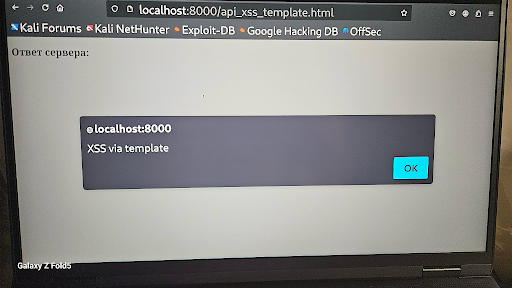
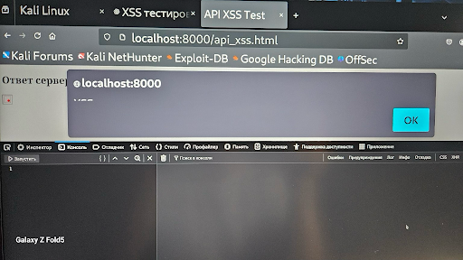

# 🛡️ Vulnerability Report: API XSS via `innerHTML` and JSON Response

---

## 🧪 Test Context

- **Target**: Custom API endpoint rendering response into the DOM
- **Security Context**: JavaScript `innerHTML`
- **Test File**: `api_xss.html`
- **Vulnerable Sink**: `element.innerHTML = ...`
- **Payload Used**:
```html
<script>alert("XSS via innerHTML")</script>
```
- **Execution**: The payload was inserted into a JSON response and parsed into the DOM using `innerHTML`, resulting in JavaScript execution.

---

## ✅ Result

- JavaScript alert successfully triggered.
- Confirmed vulnerability due to use of `innerHTML` to inject untrusted content into DOM.
- Vulnerable context: `innerHTML` allows parsing and execution of script content.

---

## 🖼️ Screenshot Evidence

📸 **Screenshot 1**: DOM alert triggered from injected payload  


📸 **Screenshot 2**: Developer tools showing injection context with `innerHTML`  


📸 **Screenshot 3**: View of rendered vulnerable page and source  


---

## 🛡️ Recommendations

- ❌ Avoid using `innerHTML` with untrusted data.
- ✅ Use `textContent` or DOM-safe functions like `createTextNode()`.
- ✅ Sanitize all inputs and enforce strict CSP headers:
```http
Content-Security-Policy: script-src 'self'; object-src 'none';
```
- ✅ Use templating engines or trusted renderers for safe dynamic content injection.

---

## 👩‍💻 Tester Information

- **Tested by**: Tetiana Trunova  
- **Date**: July 2025  
- **Environment**: Kali Linux + Localhost (API testing on `localhost:8000`)
