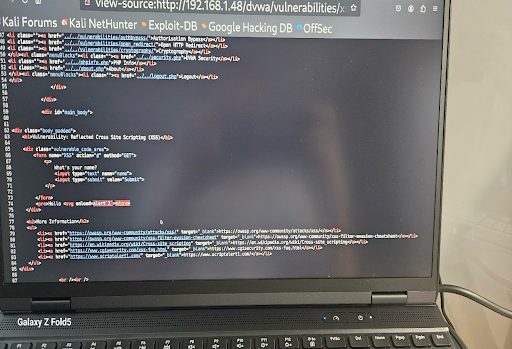
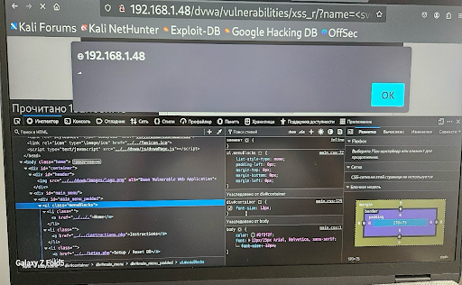
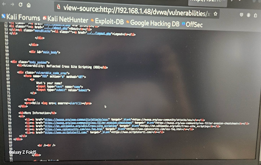
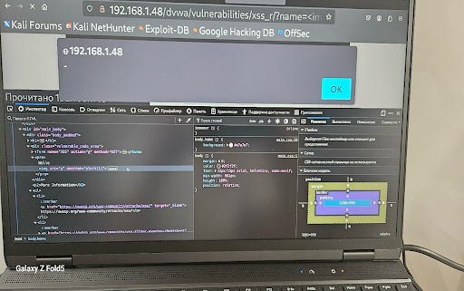
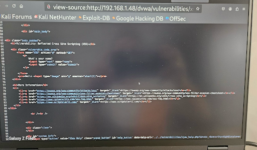
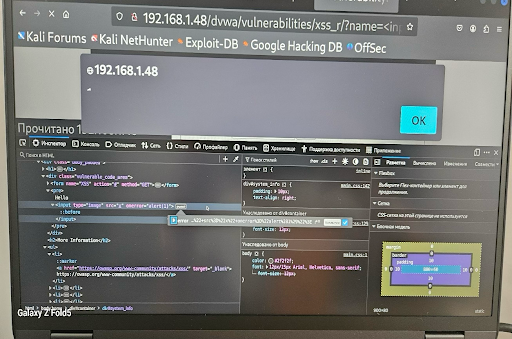
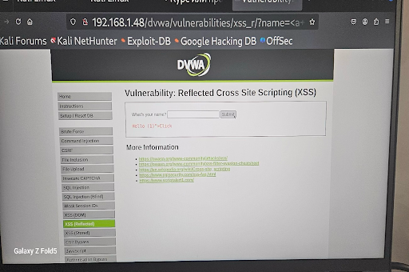
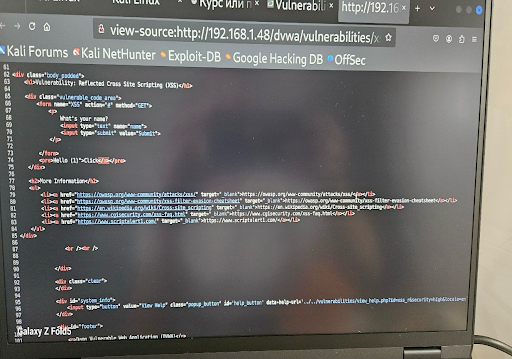
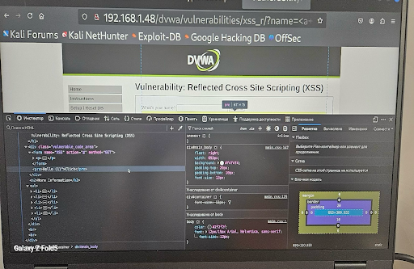

# 🧪 XSS Report — Reflected XSS (High Level)

**📘 Environment:** DVWA (High Security Level) on Kali Linux + Ubuntu Server  
**🌐 Target URL:**  
http://192.168.1.48/dvwa/vulnerabilities/xss_r/?name=<payload>  
**👤 Tester:** Tetiana Trunova

---

## 🔍 Vulnerability Overview
This report documents a successful Reflected Cross-Site Scripting (XSS) attack on the DVWA platform at the **High** security level.

**🧬 Vulnerability Type:** Reflected XSS (High)  
**🧭 Affected Parameter:** `name` in URL query string

---

## 💣 Payloads Tested

1. ``  
   _Standard image-based payload using `onerror`._

2. `<svg/onload=alert(1)>`  
   _SVG tag triggers JavaScript alert._

3. `<input type="image" src=x onerror=alert(1)>`  
   _Input-based image payload with `onerror`._

All payloads triggered alert boxes, demonstrating successful JavaScript execution.

---

## 🧪 Steps to Reproduce

1. Navigate to the DVWA Reflected XSS (High) page.
2. Inject one of the tested payloads into the `name` parameter of the URL.
3. Press Enter and observe browser behavior.
4. DOM inspection or page source reveals how payload was handled.

---

## 📸 Evidence

### Screenshot 1

### Screenshot 2

### Screenshot 3

### Screenshot 4

### Screenshot 5

### Screenshot 6

### Screenshot 7

### Screenshot 8

### Screenshot 9

_The screenshots confirm alert boxes, source code reflection, and DOM rendering._

---

## 💥 Impact

This vulnerability could allow:

- JavaScript execution in a user's browser
- Session hijacking
- Credential theft
- Redirection to malicious sites

---

## 🛡️ Recommendations

- Implement input sanitization using secure libraries
- Apply Content Security Policy (CSP) headers
- Escape output contextually in templates
- Avoid unsafe DOM manipulations

---

## 👩‍💻 Tester Information

- **👤 Name:** Tetiana Trunova  
- **🗓 Date:** 25.07.2025  
- **🛠 Tools:** Kali Linux, Firefox, Burp Suite  
- **🎯 Test Target:** DVWA – Reflected XSS (High)  
- **📌 Purpose:** Bug Bounty documentation, XSS portfolio

---

_This report is part of the [XSS Vulnerability Testing Portfolio](../README.md)._
