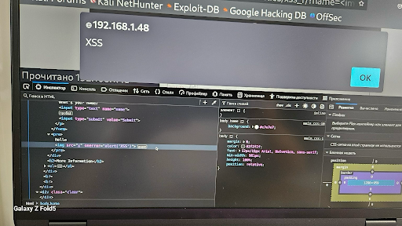

# 🧪 XSS Report — Reflected XSS (Low Level)

**Environment:** DVWA on Kali Linux + Ubuntu  
**Tested URL:**  
http://192.168.1.48/dvwa/vulnerabilities/xss_r/?name=

---

## 🧾 Steps to Reproduce:
1. Open the DVWA Reflected XSS page.
2. Append the 'name' parameter in the URL with the payload:  
   ``
3. The JavaScript alert will execute immediately, confirming the vulnerability.

---

## 💥 Impact:
An attacker could trick users into visiting a crafted URL that executes arbitrary JavaScript in their browser.  
This can lead to session hijacking, credential theft, phishing, or redirection to malicious sites.

---

## ✅ Recommendations:
- Sanitize user input using functions like `htmlspecialchars()` in PHP.
- Use Content Security Policy (CSP) headers to restrict JavaScript execution.
- Avoid inserting untrusted input directly into HTML or JavaScript.
- Use frameworks that auto-escape (e.g., React, Django).

---

## 🖼️ Visual Proof

### Screenshot 1

_This screenshot demonstrates successful execution of a Reflected XSS payload at Low security level in DVWA. The alert `alert('XSS')` was triggered._

---

## 🧑‍💻 Tester Information

- **Name:** Tetiana Trunova  
- **Date:** 21.07.2025  
- **Tools Used:** Kali Linux, Firefox, Burp Suite  
- **Test Target:** DVWA — Reflected XSS (Low)  
- **Purpose:** Documented test for Bug Bounty portfolio

---

🗂️ *This report is part of the [XSS Vulnerability Testing Portfolio](../README.md).*
