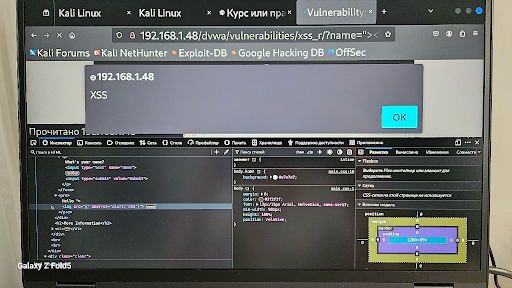
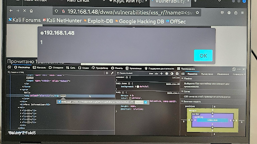
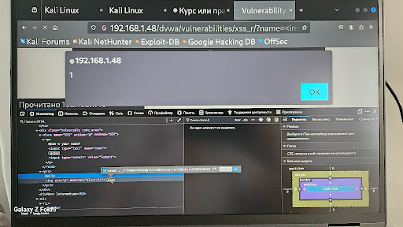

# 🧪 XSS Report — Reflected XSS (Medium Level)

**Environment:** DVWA (Medium Security Level) on Kali Linux + Ubuntu Server  
**Target URL:**  
http://192.168.1.48/dvwa/vulnerabilities/xss_r/?name=<payload>  
**Tester:** Tetiana Trunova

---

## 🔎 Vulnerability Overview

This report documents a successful Reflected Cross-Site Scripting (XSS) attack on the DVWA platform at the **Medium** security level.

---

## 🧪 Payloads Tested

1. ``  
   _Bypasses basic input validation using `` with `onerror` event._

2. `<svg/onload=alert(1)>`  
   _SVG tag triggers alert successfully even when basic tags are filtered._

3. ``  
   _Encoded payload variation of image-based XSS._

All tested payloads successfully executed JavaScript code and displayed an alert box.

---

## 🧾 Steps to Reproduce

1. Navigate to the DVWA Reflected XSS (Medium) page.
2. Append one of the payloads above to the `name` parameter in the URL.
3. Press Enter and observe the response.
4. The payload is reflected inside the page without sanitization and is executed.

---

## 🧼 Evidence

### Screenshot 1

### Screenshot 2

### Screenshot 3

_The screenshots show the DOM structure and alert pop-ups confirming the vulnerability._

---

## 💥 Impact

This vulnerability allows attackers to execute arbitrary JavaScript in a user's browser by tricking them into clicking a malicious link. This can lead to:

- Session hijacking
- Credential theft
- Redirection to phishing or malicious sites

---

## ✅ Recommendations

- Apply server-side validation and proper context-aware output encoding
- Enforce strict CSP (Content Security Policy) headers
- Avoid inserting untrusted input directly into the HTML response
- Use frameworks like React, Vue, or Angular that auto-escape values
- Sanitize inputs using libraries like DOMPurify

---

## 🧑‍💻 Tester Information

- **Name:** Tetiana Trunova  
- **Date:** 22.07.2025  
- **Tools Used:** Kali Linux, Firefox, Burp Suite  
- **Test Target:** DVWA — Reflected XSS (Medium)  
- **Purpose:** Documented test for Bug Bounty portfolio

---

🗂️ *This report is part of the [XSS Vulnerability Testing Portfolio](../README.md).*
